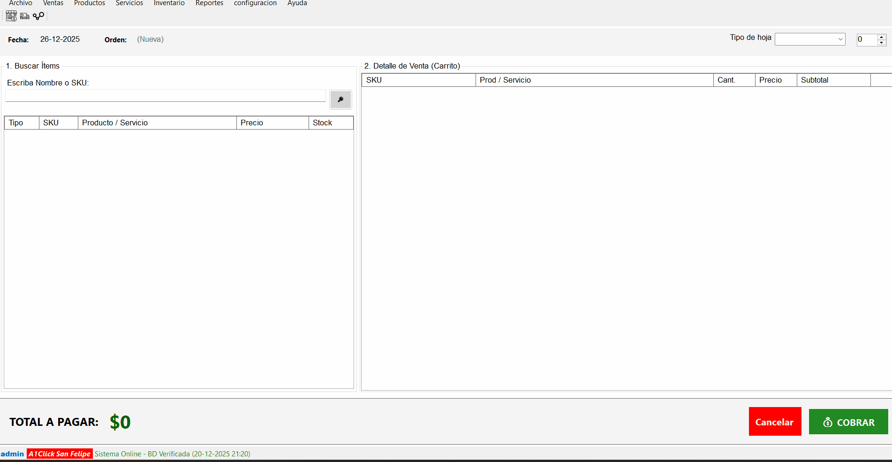
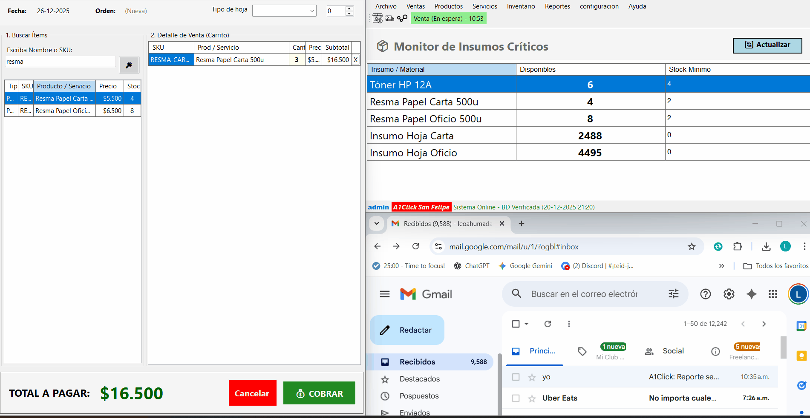
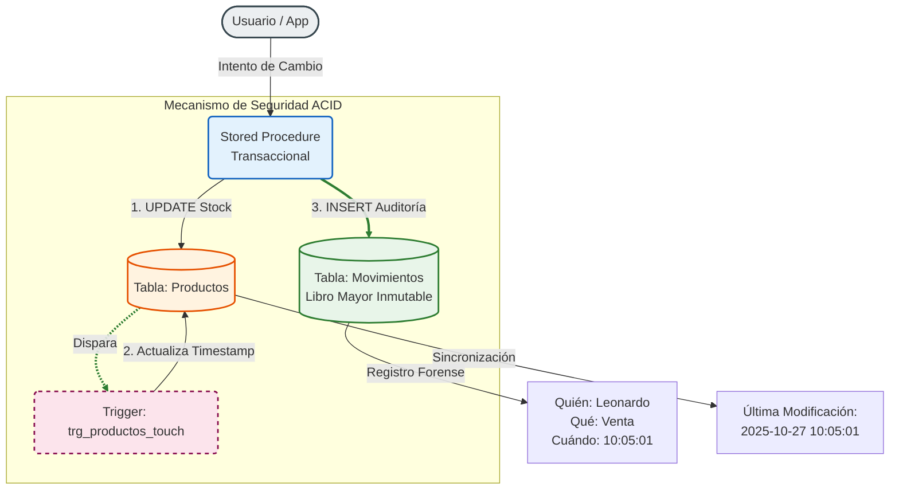

# 🚀 A1Click - Sistema de Gestión de Inventario Resiliente (.NET + SQL Server)

> **Sistema de Punto de Venta diseñado con arquitectura offline-first, integridad ACID y automatización de infraestructura.**

*(Clic en la imagen para ver la demo de 1 min)*

---

## 📸 Galería Rápida

| Venta Rápida (Teclado) | Alerta de Stock Automática |
| :---: | :---: |
|  |  |

---

## 🏗️ Arquitectura de Solución
El sistema prioriza la integridad de datos y la trazabilidad forense, implementando un mecanismo de "Defensa en Profundidad" a nivel de base de datos.

### Mecanismo de Seguridad y Auditoría (ACID)

## 💻 Ingeniería de Software (Snippets Destacados)

> *Nota: Este es un proyecto de código cerrado (Proprietary Software). Se presentan fragmentos clave para demostrar la calidad de la arquitectura.*

### 🔐 1. Integridad de Datos (Backend SQL)
Implementación de transacciones atómicas para asegurar que el inventario y la caja siempre cuadren.
* 📄 **Ver Código:** [ACID_Transaction_Snippet.sql](src/database_snippets/ACID_Transaction_Snippet.sql)
* 📄 **Ver Código:** [Async_Outbox_Pattern_Snippet.sql](src/database_snippets/Async_Outbox_Pattern_Snippet.sql)

### 🛡️ 2. Resiliencia y UX (Frontend C#)
Manejo de fallos de red y optimización de flujos de trabajo mediante atajos de teclado globales.
* 📄 **Ver Código:** [Resiliencia_json_Snippet.cs](src/csharp_snippets/Resiliencia_json_Snippet.cs) *(Persistencia local ante fallos)*
* 📄 **Ver Código:** [UX_AtajosTeclado_Snippet.cs](src/csharp_snippets/UX_AtajosTeclado_Snippet.cs) *(Interceptación de teclas a bajo nivel)*

### 🧠 3. Lógica de Dominio (Core C#)
Encapsulamiento de reglas de negocio y validación de cuadratura financiera previo a la persistencia.
* 📄 **Ver Código:** [VentaService_LogicaNegocio.cs](src/csharp_snippets/VentaService_LogicaNegocio.cs) *(Validaciones de integridad y reglas de negocio)*

---

## 📄 Documentación Completa
Para un análisis profundo de las decisiones de ingeniería, consulte los informes técnicos:

* 📘 **[Informe de Arquitectura de Aplicación (PDF)](Informe_App_A1Click.pdf)**
* 📙 **[Informe de Ingeniería de Datos (PDF)](Informe_baseDatos_A1Click.pdf)**

---
**Desarrollado por Leonardo Ahumada** | *Ingeniero de Software .NET / SQL*